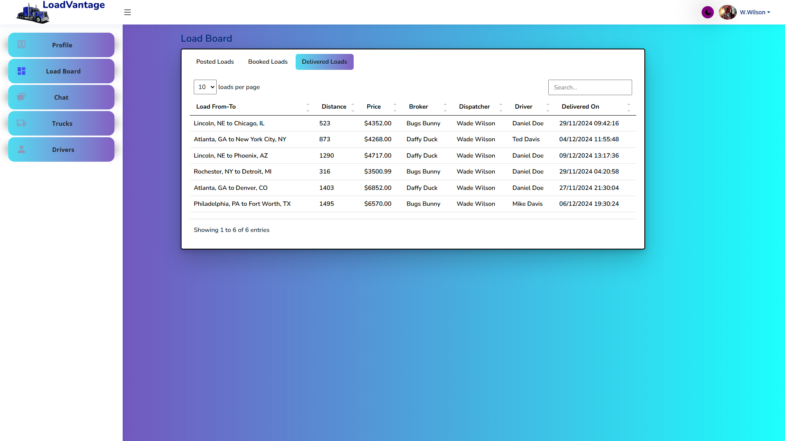

 

   
   

  <h2>
    LoadVantage Web Project Application:
  </h2>

  <ul>
   
 This web application was created as a final project in The Software University's ASP.NET Advanced Course 2024. It is a type of multiservice monolith. The application itself represents a load board web application that users ( Brokerage Firms and Truck Load Carriers ) can use to connect and do business. Users can be two types Brokers and Dispatchers. Brokers can create loads, post the them on the loadboard and on the other side a Dispatcher can book the load and assign a Driver and a Truck on it. After successful completion of the load the Dispatchers mark the load as delivered. Brokes can also unpost loads that are posted ( one or multiple ). They can cancel loads altogether ( essentially removing the load from their boards ) or cancel the Truck Load Carrier that is already assigned on the load. A Dispatcher can also cancel a load ( essentially returning the load to it's owner - the Broker that created it ).

   
 The application has two main roles --> 🔵Administrator and 🔴User. Registering an account creates only Users ( Two types of users --> Dispatcher and Broker ). 
        Administrators can either be directly seeded in the database or manually created by another Administrator using the User Management panel. 

    
   🔵 Administrators can manage users, manage loads, start a chat with all Users and other Administrators, view application statistics and pull pie chart reports. 
    
    
   🔴 Dispatchers can book posted loads on the Load Board, manage trucks in their fleet, manage drivers in their company, return booked loads back to the owner ( Broker ), message any broker that has a Posted Load.
    
    
   🔴 Brokers can create a load, edit a load ( in all statuses except Cancelled ), post a load, cancel a load, cancel a carrier assigned to a load (as long as they are the owner of the load ), chat with Users and Administrators ( if they are contacted first ),              
    

   ✅ Both Users and Administrators can view their own profiles, summary of their loads if Brokers and summary of the Booked or Delivered loads if Dispatchers and a summary of their Trucks and Drivers, they can edit the profile information, edit or remove their profile picture🌟 and change their password.
     
     
    🌟 One difference here is that Administrators can use a .GIF image for their profile picture and Users cannot.
   
  </ul>
   

  <h2>
    Database Diagram:
  </h2>

   

   
   

  <h2>
    Technology Stack:
  </h2>
  
  <h3>Front End:</h3>
  <ul>
    <li>HTML & CSS</li>
    <li>SCSS</li>
    <li>Bootstrap 5</li>
    <li>JavaScript</li>
    <li>jQuery</li>
    <li>AJAX</li>
    <li>Figma</li>
    <li>Scalable Vector Graphics</li>
    <li>BoxIcons & RemixIcons</li>
    <li>Simple Datatables</li>
    <li>Apex Charts</li>
    <li>Photoshop & AI Image Generators for any images</li>
  </ul>

  <h3>Back End:</h3>
  <ul>
   <li>C#</li>
   <li>.NET 8.0</li>
   <li>.NET Core</li>
   <li>ASP.NET with MVC pattern</li>
   <li>Microsoft SQL Server</li>
   <li>Entity Framework Core</li>
   <li>Html Sanitizer Library by Michael Ganss</li>
   <li>SignalR</li>
   <li>OpenCage Geocoding RESTful API (  2,500 API requests/day for testing ) </li>
   <li>OpenRouteService RESTful API ( Directions V2 - 2000 API requests/day free )</li>
   <li>Country State City RESTful API ( No limitations, but request responsibly! )</li>
   <li>Cloudinary (Cloud Image & Video Management Service)</li>
  </ul>

  <h3>Testing:</h3>
  <ul>
    <li>NUnit</li>
    <li>Moq</li>
    <li>MockQueryable</li>
    <li>Entity Framework Core InMemory</li>
  </ul>

<h3>Source Control:</h3>
  <ul>
    <li>Git / GitHub</li>
  </ul>

 <h2>
    User Guide with screenshots:
  </h2>

 
    
<h2>Home Page</h2>

 
   

   - The Home page consists of a navigation bar with three buttons ( Home, Register, Login ), logo and name, SVG animation of a truck moving, flip cards, 
   "Meet Our Partners" section, "Our Achievements" section, and a footer with links, company information, social links and contact information.
   

   

   
   

 
 
<h2>Register Page</h2>

   
   

   - The Register page consists of a navigation bar with three buttons ( Home, Register, Login ) and a form with information needed to register a new user in the application.
   

   

   
   

 

   
<h2>Login Page</h2>

   

   - The Login page consists of a navigation bar with three buttons ( Home, Register, Login ) and a form with information needed for a registered user to log in.
   

   

   
   

   
<h2>Privacy Policy Page</h2>

   

   - The Privacy Policy page consists useful information for the application itself and a about the Author section.
   

   

   
   

 
<h2>Profile Page</h2>

 

   - After successfully logging in a User would be redirected to the Profile Page
     
  - The Profile page shows a card containing the User's full name, position and company and below it depending if User is a Dispatcher or Broker there would be counts for Drivers, Trucks, Booked and Delivered Loads ( Dispatchers ) and Created, Posted, Booked and Delivered Loads ( Broker )
     
  - In the tabulated container to the right of the general info card there is a Profile Overview tab, Edit Profile Tab, Edit Picture tab and Change Password Tab
     
      <h6>⭐ Profile Overview tab shows the information for the currently logged in User.</h6>
      <h6>⭐ Edit Profile Tab lets the User edit any of the information visualized in the overview.</h6>
      <h6>⭐ Edit Picture tab shows the profile picture and gives the User the option to delete it ( default to the generic picture ) or upload a new one.</h6>
      <h6>⭐ Change Password Tab gives the User the option to change his password.</h6>   
 

   

   
   

   
   

   
   

   

 
<h2>Chat Page</h2>

 

   - Chat Page is available to Users and Administrators alike.
     
   - Brokers cannot engage in conversation directly, they need to be contacted by a Dispatcher or an Administrator.
     
   - Dispatchers can only contact Brokers through a redirect available to them when viewing a Posted load ( they can contact the broker of the load ).
     
   - Administrators can contact both Dispatchers or Brokers using that redirect when viewing a load or go to the User Management Page and use the redirect there.
     
     
 

   

   
   

   
   

   
   

   

 
<h2>Brokers</h2>

<!-- Broker Create Load -->

 
<h3>Broker - Create a load</h3>

 

  - Page consists of a simple form for adding new loads in the Broker's Created Loads 
     
    <h6>⭐ Create Load ---> Attempt to add a load to the database and to the Broker's loads, if information is valid. </h6>
    <h6>⭐ Reset ---> This action would reset the form essentially deleting values from the origin and destination city and state, resetting pickup and delivery time to now and setting the Price and Weight to their default value of 1.</h6>
  
 

   
   

   
   

   
   

<!-- Broker Load Board Created Loads Tab & Viewing a Created Load -->

 

 
<h3>Broker Load Board & Viewing a Created Load</h3>

 

   - After a Broker opens the Load Board, he will be redirected to the Created Loads Tab, where he can view all the loads that he/she created.
     
  - Search available right on the Board, that would filter the loads as the Broker types
     
  - Sorting functionality available for each piece of information visualized ( for instance Broker can sort all loads by pickup state or price ascending or descending )
     
  - Paginаtion also available right in the table, Broker can choose how many loads per page to show ( 5, 10, 15 ) or show all loads
     
  - Clicking on the button on the right in the "Actions" section will take the Broker to the Load View:
     
    <h6>⭐ Edit ---> This action would give the Broker access to edit the load information. Buttons "Save" and "Cancel" appear while load is being edited.</h6>
    <h6>⭐ Post ---> This action would post the load, essentially changing it's status from Created to Available. </h6>
    <h6>⭐ Cancel Load ---> This action would cancel the load, removing it entirely from the Broker's Board. </h6>
    <h6>⭐ Back to Load Board ---> This action would return the Broker back to the Load Board ( and the Created tab ). </h6>
 

   
   

   
   

   
   

<!-- Broker Load Board Posted Loads Tab & Viewing a Posted Load -->

 
 <h3>Broker Viewing a Posted Load</h3>

 

   - After a Broker posts a load, he/she will be redirected to the Load Board's Posted Loads Tab.
     
  - Search, Sorting and Paginаtion is available on every tab of the Load Board. 
     
  - Clicking on the button on the right in the "Actions" section will take the Broker to the Load View:
     
    <h6>⭐ Edit ---> This action would give the Broker access to edit the load information. Buttons "Save" and "Cancel" appear while load is being edited.</h6>
    <h6>⭐ Unpost ---> This action would unpost the load, essentially changing it's status from Available back to Created. </h6>
    <h6>⭐ Unpost All  ---> This action would unpost all loads, that are currently in in status Available and revert them back to Created.</h6>
    <h6>⭐ Cancel Load ---> This action would cancel the load, removing it entirely from the Broker's Board. </h6>
    <h6>⭐ Back to Load Board ---> This action would return the Broker back to the Load Board ( and the Created tab ). </h6>
 

 
   

   
   

  

<!-- Broker Load Board Booked Loads Tab & Viewing a Booked Load -->

 
<h3>Broker Viewing a Booked Load</h3>

 

   - Any loads that are booked by a Dispatcher, would be sent to the Booked Loads Tab.
     
  - Search, Sorting and Paginаtion is available on every tab of the Load Board. 
     
  - Clicking on the button on the right in the "Actions" section will take the Broker to the Load View:
     
  - Additional details are available to the Broker for the Dispatcher if the load is Booked. When the Dispatcher that booked the load assign a driver, information for that driver would be visualized for the Broker in that same mini window as well.
     
    <h6>⭐ Edit ---> This action would give the Broker access to edit the load information. Buttons "Save" and "Cancel" appear while load is being edited.</h6>
    <h6>⭐ Cancel Carrier ---> This action would cancel the carrier on the load ( and truck if there is one assigned ) and return the load back to status Posted. </h6>
    <h6>⭐ Cancel Load ---> This action would cancel the load, removing it entirely from the Broker's Board. </h6>
    <h6>⭐ Details  ---> This action toggles the info mini window on the left side containing info about the Dispatcher and Driver (if there is one assigned).</h6>
    <h6>⭐ Back to Load Board ---> This action would return the Broker back to the Load Board ( and the Created tab ). </h6>
 

   

   
   

   
   

<!-- Broker Load Board Delivered Loads Tab -->

 
<h3>Broker Load Board Delivered Loads Tab</h3>

 

   - Once a load has a Driver assigned by the Dispatcher that booked the load, he can mark it as delivered. All delivered loads for a Broker go to the Delivered Tab on the Load Board.
     
  - Information for the Dispatcher and Driver that finished the load is available to make it easier to sort if needed. 
     
 

   

   
   

   
   

<!-- Dispatchers Section -->

 
<h2>Dispatchers</h2>

 
 <!-- Dispatcher Posted Loads Tab & Viewing a Posted Load -->

 
 <h3>Dispatcher Viewing a Posted Load</h3>

 

   - After a Broker posts a load, any Dispather would be able to see it in his Posted Loads Tab on the Load Board Page.
     
  - Search, Sorting and Paginаtion is available on every tab of the Load Board. 
     
  - Clicking on the button on the right in the "Actions" section will take the Dispatcher to the Load View:
     
    <h6>⭐ PM the Broker ---> This action will take the Dispatcher to the Chat Page and open a chat with the Broker of the load he was viewing.</h6>
    <h6>⭐ Book this Load ---> This action will book the load, essentially changing it's status from Available to Booked. Dispatcher will now be able to see that load in the Booked Loads Tab on the Load Board Page.</h6>
    <h6>⭐ Back to Load Board ---> This action would return the Dispatcher back to the Load Board ( and the Posted tab ). </h6>
 

 
   

   
   

  

 <!-- Dispatcher Booked Loads Tab & Viewing a Booked Load -->

 <h3>Dispatcher Viewing a Booked Load</h3>

 

   - All the loads that a Dispatcher booked would be visible in the Booked Loads Tab on the Load Board Page.
     
  - Search, Sorting and Paginаtion is available on every tab of the Load Board. 
     
  - If there is a Truck and Driver assigned to the load already, the column "Status" would show "en route".
     
  - Clicking on the button on the right in the "Actions" section will take the Dispatcher to the Load View:
     
    <h6>⭐ PM the Broker ---> This action will take the Dispatcher to the Chat Page and open a chat with the Broker of the load he was viewing.</h6>
    <h6>⭐ Select a Driver ---> This action will assign a Driver to the load. From the dropdown the Dispatcher will choose an active driver that is available for a load ( if a driver is not available he will not be shown in the dropdown ) and then save his/her choice. </h6>
    <h6>⭐ Cancel Load ---> This action will return the load back to the broker ( changing the status of the load from Booked back to Posted ). If there is a Truck & Driver assigned to the load, they will be released, so they can be assigned to another load.</h6>
    <h6>⭐ Mark as Delivered ---> This action will mark the load as Delivered, release the driver and from this point on the load will be visible only in the Delivered Loads Tab on the Load Board Page ( both for the Broker and Dispatcher ). </h6>
    <h6>⭐ Back to Load Board ---> This action would return the Dispatcher back to the Load Board ( and the Posted tab ). </h6>

 

 
   

   
   

  

<!-- Dispatcher Load Board Delivered Loads Tab -->

 
<h3>Dispatcher Load Board Delivered Loads Tab</h3>

 

   - Once the load is marked delivered by the Dispatcher, it will be moved to the Delivered Loads Tab on the Load Board Page.
     
  - Information for the Broker, Dispatcher and Driver that delivered the load is available to make it easier to sort if needed. 
     
 

   

   
   

   
   

 <!-- Dispatcher Trucks -->

<h3>Dispatcher Trucks Page</h3>

 

   - The Trucks Page consists of a table with the current number of trucks in the Dispatcher's Fleet.
     
  - If there is a Truck and Driver assigned to the load already, the column "Status" would show "en route".
     
    <h6>⭐ Add Truck ---> This action will open a modal window and the Dispatcher would have to put the required information before he/she saves the new truck. </h6>
    <h6>⭐ Edit ---> This action will open a modal window with the selected truck's information loaded in. Dispatcher can edit any property and save it. </h6>
    <h6>⭐ Park ---> This action parks the truck at the yard. Truck cannot be parked if there is a driver in it and he is currently under a load (doing a load ). </h6>
    <h6>⭐ Select a driver ---> This action will give an option from the dropdown menu for an active and available Driver for the Dispatcher to assign in the selected truck. </h6>
    <h6>⭐ Delete ---> This action will essentially remove the truck from the Dispatcher's Fleet. Cannot remove a truck that is being used. Truck need to be parked first.</h6>
    

 

 
   

   
   

  

 <!-- Dispatcher Drivers -->

<h3>Dispatcher Drivers Page</h3>

 

   - The Drivers Page consists of a table with the current number of drivers in the Dispatcher's Fleet.
     
    <h6>⭐ Add Driver ---> This action will open a modal window and the Dispatcher would have to put the required information before he/she saves the new driver. </h6>
    <h6>⭐ Edit ---> This action will open a modal window with the selected driver's information loaded in. Dispatcher can edit any property and save it. </h6>
    <h6>⭐ Fire ---> This action will essentially remove the driver from the Dispatcher's driver list.</h6>
    <h6>✨✨✨ If a Driver is Available the first icon in the "Available" column would be green, otherwise it will show a truck, meaning Driver is assigned in a Truck. In addition if he is in a Truck the "Actions" column will now show "ready for a load".</h6>
    <h6>✨✨✨ If a Driver is in a Truck and assigned on a load the second icon in the "Available" column will now show a package icon signifying that the driver is under a lot as oposed if he is not it will show a house icon ( meaning he is at home base )</h6>

 

 
   

   
   

  

 
<h2>Administrators</h2>

 <!-- Administrator Profile Page -->

<h3>Administrator Profile Page</h3>

 

   - Once an Administrator logs in, he/she is redirected to the Profile Page.
     
   - The main difference between the Dispatcher and Broker Profile page is the card below the profile picture contains information about the total revenue, total number of users and total number of loads.
     
   - The Overview, Edit Profile, Edit Picture and Change Password are also available.
     
   <h6>✨✨✨ Key difference here is that Administrators can addd .GIF images as their profile picture, unlike Users</h6>
 

 
   

   
   

  

 <!-- Administrator Load Board Created Tab Page -->

<h3>Administrator Load Board Created Loads Tab</h3>

 

   - An Administrator can see all Created Loads for all Brokers. 
     
   - Search, Sorting and Paginаtion is available on every tab of the Load Board. 
     
    <h6>⭐ Edit ---> This action will open the viewed load for changes. </h6>
    <h6>⭐ PM the Broker ---> This action will take the Administrator to the Chat Page and open a chat with the Broker of the load he was viewing.</h6>
    <h6>⭐ Details  ---> This action toggles the info mini window on the left side containing info about the Broker when the load is in status Created.</h6>
    <h6>⭐ Back to Load Board ---> This action would return the Administrator back to the Load Board ( and the Created tab ). </h6>
 

 
   

   
   

  

 <!-- Administrator Load Board Posted Tab Page -->

<h3>Administrator Load Board Posted Loads Tab</h3>

 

   - An Administrator can see all Posted Loads for all Brokers, just like Dispatchers. 
     
   - Search, Sorting and Paginаtion is available on every tab of the Load Board. 
     
    <h6>⭐ Edit ---> This action will open the viewed load for changes. </h6>
    <h6>⭐ PM the Broker ---> This action will take the Administrator to the Chat Page and open a chat with the Broker of the load he was viewing.</h6>
    <h6>⭐ Details  ---> This action toggles the info mini window on the left side containing info about the Broker when the load is in status Created.</h6>
    <h6>⭐ Back to Load Board ---> This action would return the Administrator back to the Load Board ( and the Created tab ). </h6>
 

 
   

   
   

  

 <!-- Administrator Load Board Booked Tab Page -->

<h3>Administrator Load Board Booked Loads Tab</h3>

 

   - An Administrator can see all Booked Loads for all Brokers. 
     
   - Search, Sorting and Paginаtion is available on every tab of the Load Board. 
     
   - Similar to the Broker and Dispatcher, if a Booked load has a Driver assigned already in the "Status" column it shows "en route". 
     
   - The details mini window will show the Broker information, Dispatcher information and if a Driver is assigned - the Driver information. 
     
    <h6>⭐ Edit ---> This action will open the viewed load for changes. </h6>
    <h6>⭐ PM the Broker ---> This action will take the Administrator to the Chat Page and open a chat with the Broker of the load he was viewing.</h6>
    <h6>⭐ PM the Dispatcher ---> This action will take the Administrator to the Chat Page and open a chat with the Dispatcher of the load he was viewing.</h6>
    <h6>⭐ Details  ---> This action toggles the info mini window on the left side containing info about the Broker when the load is in status Created.</h6>
    <h6>⭐ Back to Load Board ---> This action would return the Administrator back to the Load Board ( and the Created tab ). </h6>
 

 
   

   
   

  

 <!-- Administrator Load Board Delivered Tab Page -->

<h3>Administrator Load Board Delivered Loads Tab</h3>

 

   - An Administrator can see all Delivered Loads for all Brokers and Dispatchers. 
     
   - Search, Sorting and Paginаtion is available on every tab of the Load Board. 
     
   - Unline the Brokers and Dispatchers, the Administrator can view each Delivered Load and if need be do any adjustments to it ( edit it ). 
     
   - The details mini window will show the Broker information, Dispatcher information and the Driver information. 
     
    <h6>⭐ Edit ---> This action will open the viewed load for changes. </h6>
    <h6>⭐ PM the Broker ---> This action will take the Administrator to the Chat Page and open a chat with the Broker of the load he was viewing.</h6>
    <h6>⭐ PM the Dispatcher ---> This action will take the Administrator to the Chat Page and open a chat with the Dispatcher of the load he was viewing.</h6>
    <h6>⭐ Details  ---> This action toggles the info mini window on the left side containing info about the Broker when the load is in status Created.</h6>
    <h6>⭐ Back to Load Board ---> This action would return the Administrator back to the Load Board ( and the Created tab ). </h6>
 

 
   

   
   

  

 <!-- Administrator Load Board Cancelled Tab Page -->

<h3>Administrator Load Board Cancelled Loads Tab</h3>

 

   - An Administrator can see all Cancelled Loads for all Brokers and Dispatchers. 
     
   - Search, Sorting and Paginаtion is available on every tab of the Load Board. 
     
   - Unlike the Brokers and Dispatchers, the Administrator can not only view each Cancelled Load , but also edit it . 
     
   - The details mini window will show the Broker information. 
     
    <h6>⭐ Edit ---> This action will open the viewed load for changes. </h6>
    <h6>⭐ Restore Load ---> This action will allow the Administrator to move the load from status Cancelled to status Created, essentially returning it in the Created Loads tab of the Broker that owns it.</h6>
    <h6>⭐ PM the Broker ---> This action will take the Administrator to the Chat Page and open a chat with the Broker of the load he was viewing.</h6>
    <h6>⭐ Details  ---> This action toggles the info mini window on the left side containing info about the Broker when the load is in status Created.</h6>
    <h6>⭐ Back to Load Board ---> This action would return the Administrator back to the Load Board ( and the Created tab ). </h6>
 

 
   

   
   

  

 <!-- Administrator User Management Page -->

<h3>Administrator User Management Page</h3>

 

   - Page contains information for each User and Administrator registered on the platform. 
     
   - Search and Paginаtion is available right in the table. Page size is currently set at 5 results/users per page.
     
    <h6>⭐ Add User ---> This action will allow the Administrator to add new Users ( Brokers or Dispatchers ) directly. </h6>
    <h6>⭐ Add Administrator ---> This action will allow the Administrator to add new Administrators directly.</h6>
    <h6>⭐ Edit User---> This action opens the User or Administrator information in a modal window, letting the Administrator edit it.</h6>
    <h6>⭐ Chat with User  ---> Allows the Administrator to chat with any of the Users or Administrators on the platform. </h6>
    <h6>⭐ Deactivate User ---> This action anonymizes the User or Administrator ( deleting all his sensitive informaton from the DB ) and locks the account so it can no longer be used. </h6>
    <h6>⭐ Reactivate User ---> This action unlocks a locked account. </h6>
    <h6>⭐ Reset User Password ---> This action resets a User or Administrator's password to a pre-set default password. </h6>
 

 
   

   
   

  

 <!-- Administrator Statistics Page -->

<h3>Administrator Statistics Page</h3>

 

   - Page contains information for: 
     
    <h6>⭐Total User Count ( Administrators + Users ) </h6>
    <h6>⭐Total Revenue ( Amount for all Loads in Status Delivered ) </h6>
    <h6>⭐Total Loads ( Total count of all Loads in all statuses - Cancelled Loads included ) </h6>
    <h6>⭐Total Drivers ( Total count of all Drivers, both active and fired drivers counted ) </h6>
    <h6>⭐Total Trucks ( Total count of all Trucks, both active and decommissioned counted ) </h6>
    <h6>⭐List of all Companies and the number of accounts per each company that has an account on the platform</h6>
     
   - Upon clicking on the total Total Users, Total Revenue, Total Loads, Total Drivers or Total Trucks it flips the card and shows a pie chart showing percentage-wise and counts.
     
   - Pie charts can be downloaded as a report in a .SVG, .PNG or .CSV format.
 

 
   

   
   

  

 

 <h2>
    Additional features: 
  </h2>
 

<!-- Start Responsive Design -->

   

      <h3>
          Responsive design
      </h3>
    

  

 
   

      
   

    
  

<!-- End Responsive Design -->

 <!-- Start Custom Loader -->

   

      <h3>
          Custom loader animation
      </h3>
    

  

 
   

      
   

    
  

<!-- End Custom Loader -->

 <!-- Start Custom Truck Animation -->

   

      <h3>
          Custom Truck animation
      </h3>
    

  

 
   

      
   

    
  

<!-- End Custom Truck Animation-->

 <!-- Start Custom buttons  -->

   

      <h3>
          Custom buttons
      </h3>
    

  

 
   

      
   

   

      
   

   

      
   

    

      
   

    
  

<!-- End Custom buttons -->

   

      <h3>
          Custom cards
      </h3>
    

  

 
   

      
   

  
  

 <!-- Start Sidebar Toggle and  Dark Theme  -->

   

      <h3>
          Sidebar Toggle and  Dark Theme
      </h3>
    

  

 
   

      
   

   
    
  

<!-- End Sidebar Toggle and  Dark Theme -->
 

    <h3>Just for fun:</h3>
    
I have hidden this ASCII art picture in one of the Views, see if you can find it 😏 ( .. no cheating ❗❗  )  

    

    <h3>If you like this project 💯 please give it a star ⭐ :) See you next time ! 	😉</h3>

